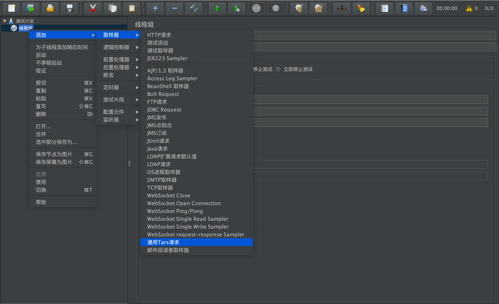
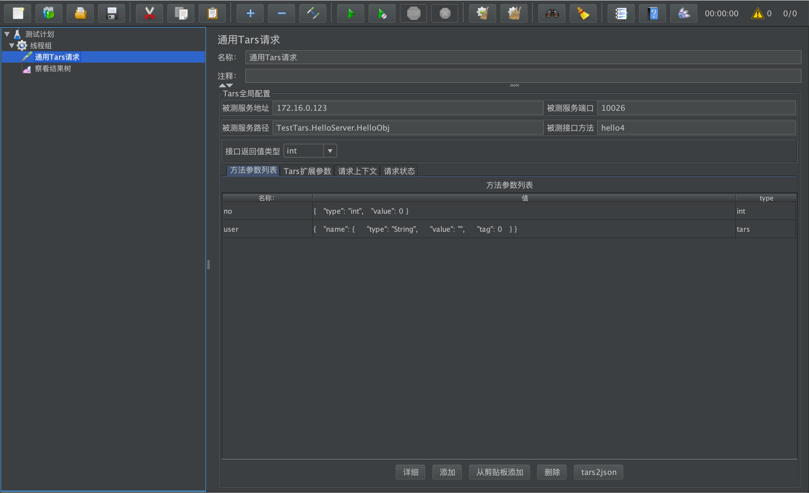
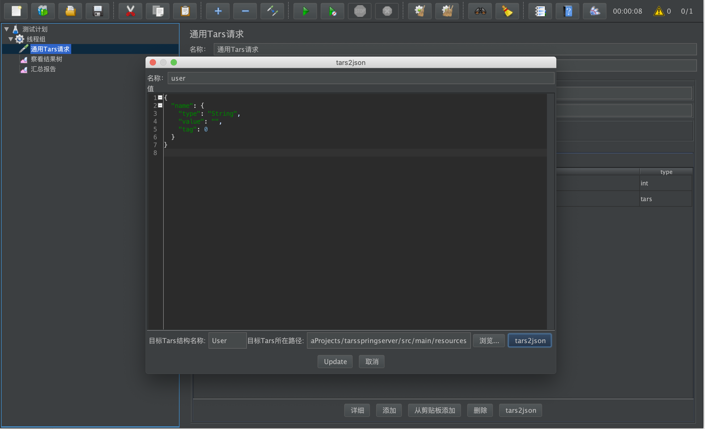
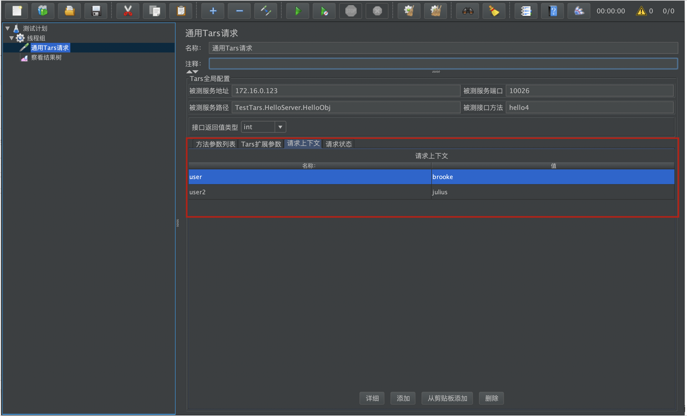
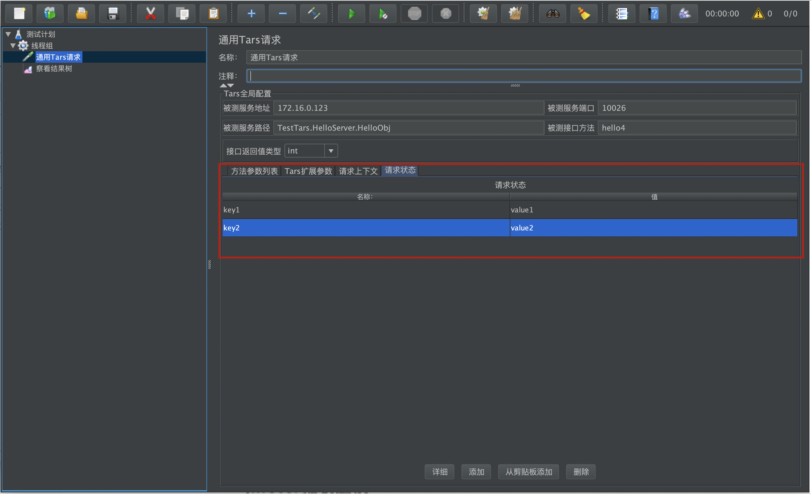
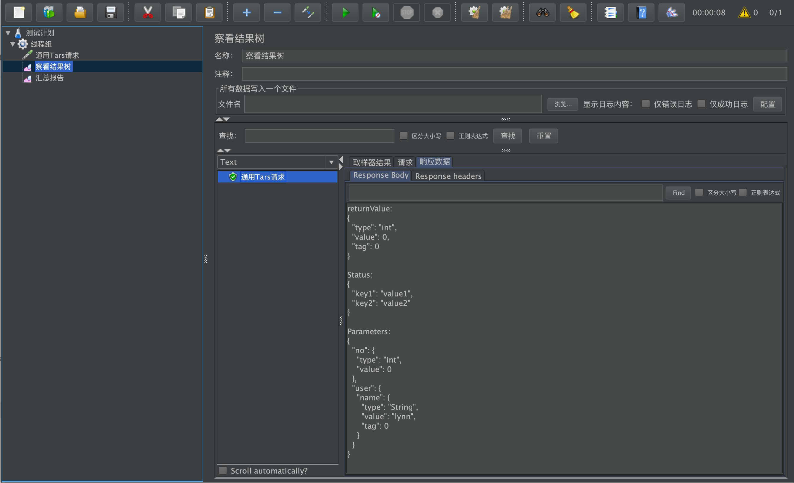
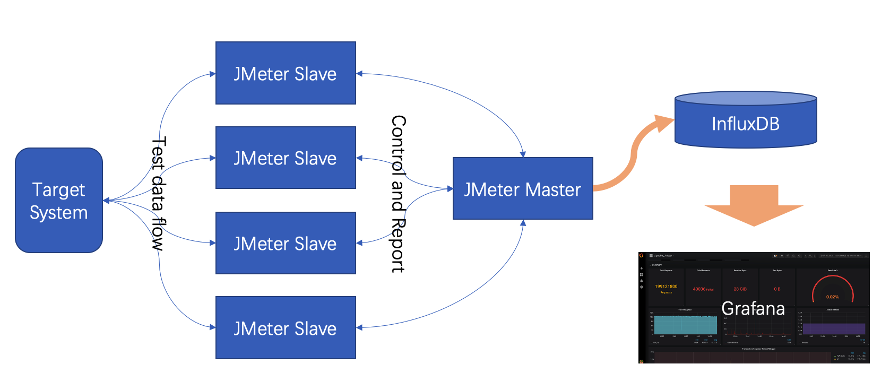

[点我查看中文版](https://github.com/TarsCloud/TarsJMeter/blob/master/README.zh.md)


## Tars Jmeter Introduction

**Tars Jmeter** is a JMeter test plug-in customized for Tars protocol. Its purpose is to help users carry out performance evaluation and testing of Tars service. You may use Tars JMeter in the following situations.

1. When you need to test the interface of a group of Tars services you develop, you can use JMeter to carry the plug-in, and perform a single test of the interface without coding based on the Tup transceiver;
2. You need to perform performance evaluation, stress test and stability test on your Tars interface，you can use JMeter to carry the plugin to commence the work.

The features of TarsJMeter are as follows:

- **Easy To Use**. Users only need to have a certain understanding of JMeter, they can use TarsJMeter simple UI to achieve test case development.
- **Support distributed**.Using the cluster mode of JMeter, the ultra-high load test of Tars service can be realized. At present, we have used the cluster mode to easily reach the performance bottleneck of a Tars service at 50,000 TPS.
- **Support complex use case scenarios**. TarsJMeter combines JMeter's rich Logic Controller, Pre Processors, Post Processors, Timer, Config Element and other components, which can enrich the test scenarios and make the test case no longer a single interface test.
- **Test report standardization**. JMeter can report the test data of Tars service to InfluxDB (time series database). InfluxDB can be connected with a third-party monitoring platform ( ex. Grafana ) to realize real-time monitoring of data traffic.

## Installation

Dependencies listed as following:

1. Install Java JDK (java 8 suggested)
2. [Download JMeter](https://jmeter.apache.org/download_jmeter.cgi)  Only unzip to the local directory, JMeter 5.2 or above is recommended;
3. /Bin in the installation directory stores the jmeter executable file; **/lib/ext** in the installation directory can add an extended third-party protocol test library;
4. Gradle compile and assemble or download by /dist
5. After building or downloading tars_jmeter.jar, put it into **/lib/ext** included by the JMeter installation directory. 

## Test Case Steps

1. Open JMeter (execute bin/jmeter.bat or bin/jmeter.sh under JMeter directory)

2. Add a thread group and a sampler in sequence. A general Tars request indicates that the installation was successful.

   

3. Select the general Tars request and create the sampler.

   Example of tars service file:

   ```
   module TestApp
     {
     	struct User {
     	    0 require string name;
     	};
     
     	interface Hello
     	{
     	    string hello(int no, string name);
     	    string hello2(string name);
     	    int hello3(int no, string name, out string meg);
     	    int hello4(int no, out User user);
     	};
     };
   ```

   Sampler sample configuration:

   

    * Service address under test: IP of Tars service under test

    * Service port under test: Tars service port under test

    * Tested service path: Servant node information of the Tars service to be tested, for example: TestTars.HelloServer.HelloObj

    * Interface method under test: the function method under test of the Tars service under test, for example: hello4

    * Interface return value type: Return value of the tested function method

    * tars2json: the tars structure in the local tars file or the directory containing tars is automatically converted to json format for testing

     

   * Method parameter list: name (custom, generally the name of the input variable of the function), method parameter list (converted to the corresponding json format according to the type of the input variable of the function), type (select the input type of the function) For example: int hello4(int no, out User user);

   * Tars extended parameters: provide basic Tars test environment configuration, which can be modified

     

   * Request context: Client context (context information) is reported, one-way from the client to the Tars server.

     

   * Request status: Two-way interaction status information between the customer and Tars service

     

4. Click Run to view the tree result, you can get the response information of Tars service

## Tars Json Data definition and instructions

The plugin uses json to define the parameters or return value data of the target Tars function, so that the Tars structured data can be better visualized. The `Tars2JsonMojo` tool integrated by the plug-in provides the ability to quickly convert data from Tars Struct to Json. The list of supported types of `json` visualization data is as follows:

`tars`  //tars structured data
`map`   //map data
`vector`
`boolean`   // 8 basic types data
`byte`
`int`
`short`
`long`
`float`
`double`
`string`
`boolean[]` // vector of 8 basic types data
`byte[]`
`int[]`
`short[]`
`long[]`
`float[]`
`double[]`
`string[]`

## Data definition examples

Definition of the basic types or vector of basic types:

- string
    ```json
    {
      "type" : "string",
      "value" : "this is a primitive type"
    }
    ```
    
- int

    ```json
    {
      "type" : "int",
      "value" : 100
    }
    ```

- int[]
  ```json
  {
    "type" : "int[]",
    "value" : [100 , 200 ]
  }
  ```

Definition of  `map<string,string>` type :

```json
{
  "type": "map",
  "value": [
    {
      "key": {
        "type": "string",
        "value": "map key",
        "tag": 0
      },
      "value": {
        "type": "string",
        "value": "map value",
        "tag": 1
      }
    }
  ],
  "tag": 0
}
```

The definition of the `vector` type. In order to make the `json` structure more concise and clear when using the more commonly used basic type `vector`, we only use `vector`to describe tars sturct's `vector`.

```json
{
  "type": "vector",
  "value": [
    {
      "type": "tars",
      "value": "more detail tars struct {}",
      "tag": 0
    },
    {
      "type": "tars",
      "value": "more detail tars struct {}",
      "tag": 0
    }
  ],
  "tag": 0
}
```

Let's take a look at the more momplex Tars structure . The correspondence between the tars IDL interface description and tars json structure is as follows:

```cpp
module Tars2JsonExample
{
  enum EOpType
  {
    EOpType_None = 0,
    EOpType_SmsAuth = 1,
  };
  
  struct SubStruct
  {
    0 optional string sub;
  };
  
  struct TarsStructExample
  {
    0 optional vector<string> stringVec;
    1 optional long tryLoginTime = 0;
    2 optional EOpType enumTest;
    3 optional vector<map<string,SubStruct>> vectorMap;
    4 optional map<int, vector<byte> > mapCheck;
  };
  
  interface Tars2JsonExampleServant
  {
    int getTarsStruct(TarsStructExample resp);
  };
}; 
```

Can be automatically converted to:

```json
{
  "stringVec": {
    "type": "string[]",
    "value": [ "" ],
    "tag": 0
  },
  "tryLoginTime": {
    "type": "long",
    "value": 0,
    "tag": 1
  },
  "enumTest": {
    "type": "int",
    "value": 0,
    "tag": 2
  },
  "vectorMap": {
    "type": "vector",
    "value": [
      {
        "type": "map",
        "value": [
          {
            "key": {
              "type": "string",
              "value": "",
              "tag": 0
            },
            "value": {
              "type": "tars",
              "value": {
                "sub": {
                  "type": "string",
                  "value": "",
                  "tag": 0
                }
              },
              "tag": 1
            }
          }
        ],
        "tag": 0
      }
    ],
    "tag": 3
  },
  "mapCheck": {
    "type": "map",
    "value": [
      {
        "key": {
          "type": "int",
          "value": 0,
          "tag": 0
        },
        "value": {
          "type": "byte[]",
          "value": [ 0 ],
          "tag": 1
        }
      }
    ],
    "tag": 4
  }
}
```

### Tars2json Instructions

When you use the plug-in, you do not need to manually write the tars data in the `json` format. The tars2json tool integrated in the plug-in will automatically recognize the tars interface file you defined and complete the conversion. You only need to:

1. Select the interface parameter or return value type;
2. If it is tars, click the tars2json button at the bottom of the plugin UI;
3. Specify "tars struct name:", such as `TarsStructExample`;
4. Select "tars file path:", which can be the directory path where the Tars file is located, or the file path of the Tars file;
5. Click the button tars2json to get the json data description corresponding to Tars Struct.

## Load Testing With Distributed Jmeter networking

JMeter has a well-known disadvantage: its classic model will create a Java Thread for each user. In terms of thread scheduling, resource consumption is relatively large, which will result in the output performance of a single JMeter pressure test machine may not be too high. 

However, JMeter supports distributed pressure testing. Through the networking shown in the following figure, the number of JMeter slaves can be expanded and contracted to easily meet the pressure requirements of various orders of magnitude.



At the same time, we can use the JMeter pressure test cluster K8s deployment solution to more easily manage the pressure test set: https://github.com/kubernauts/jmeter-kubernetes

## The suggestion of JMeter report configuration

Regardless of whether you use K8s or not, after you set up the pressure measurement environment of JMeter + Influxdb + Grafana classic networking, you can use the following Grafana dashboard to complete visual performance monitoring.

Apache JMeter Dashboard using Core InfluxdbBackendListenerClient: https://grafana.com/grafana/dashboards/5496

This dashboard requires Apache JMeter 5 and upper versions. It shows overall statistics and you can zoom on one particular transaction. In order to use it you need to use JMeter Backend Listener and select InfluxdbBackendListenerClient.

Setup:

- Add Backend Listener to your test plan (Add -> Listener -> Backend Listener) and select org.apache.jmeter.visualizers.backend.influxdb.HttpMetricsSender
- Provide in the Parameters table the InfluxDB settings, provide a name for the test, and specify which samplers to record.

For more details, see this :

- https://jmeter.apache.org/usermanual/component_reference.html#Backend_Listener
- https://jmeter.apache.org/usermanual/realtime-results.html

